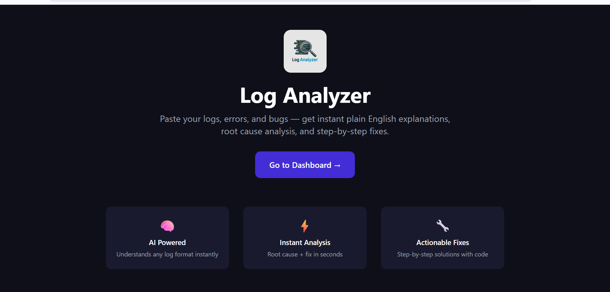
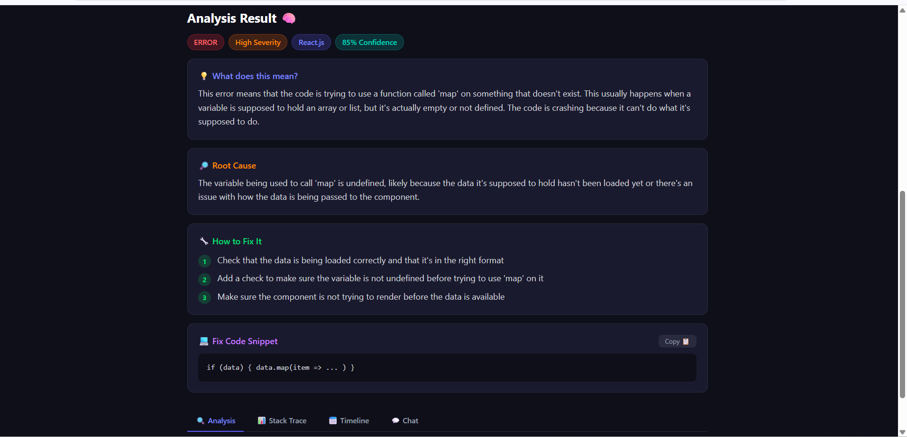
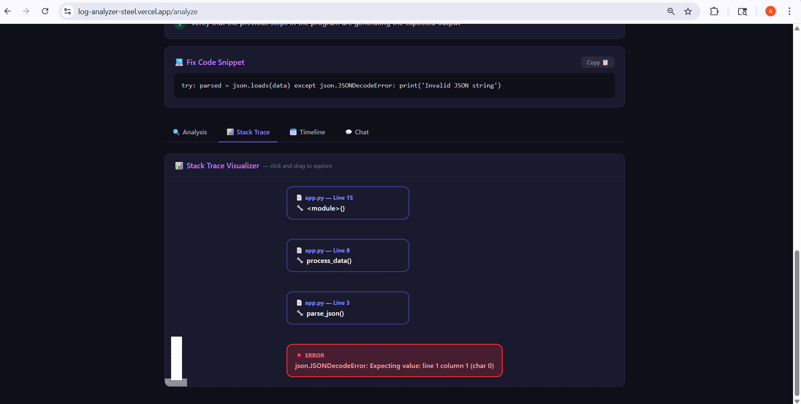
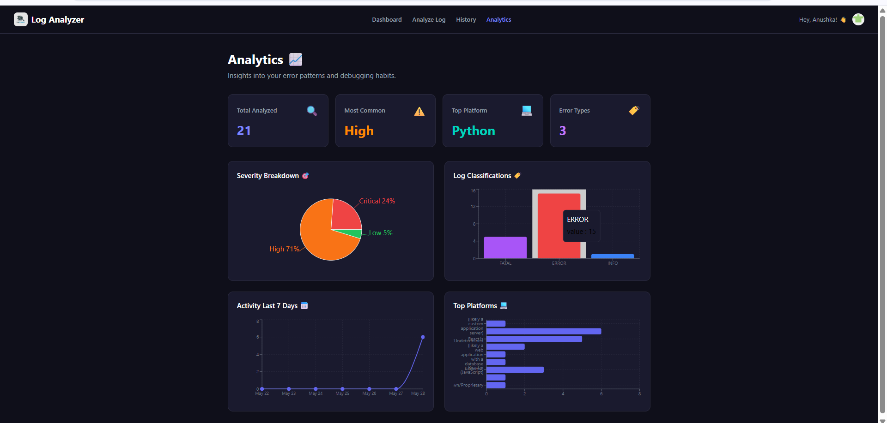
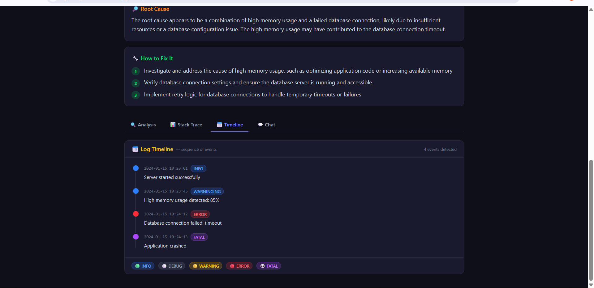

# 🔍 Log Analyzer — AI-Powered Developer Debugging Tool

<div align="center">


**Stop googling your errors. Just paste them.**

[🌐 Live Demo](https://your-vercel-url.vercel.app) 
[🐛 Report Bug](https://github.com/anushkakedari/log-analyzer/issues) 
[💡 Request Feature](https://github.com/anushkakedari/log-analyzer/issues)

</div>

---

## 📸 Screenshots

> **Landing Page**


> **AI Analysis Result**


> **Stack Trace Visualizer**


> **Analytics Dashboard**


> **Log Timeline View**


---

## 🎯 The Problem

Every developer faces this daily:
- You get a cryptic error or stack trace
- You spend 30 minutes googling what it means
- You're not even sure where to start fixing it

**Log Analyzer solves this in seconds.**

---

## ✨ Features

### 🧠 AI Analysis Engine
- **Plain English explanation** — understands what your error actually means
- **Root cause detection** — finds what actually triggered the issue
- **Step-by-step fix suggestions** — numbered, actionable solutions
- **Fix code snippets** — real code to solve the issue
- **Confidence score** — how confident the AI is in the fix
- **Auto platform detection** — Python, Node.js, Java, Docker, Kubernetes, and more

### 📥 Multiple Input Methods
- Paste raw logs directly with syntax highlighting
- Upload `.log`, `.txt`, `.json`, `.csv` files
- Drag & drop file upload
- Screenshot upload (OCR support)

### 📊 Stack Trace Visualizer
- Converts messy stack traces into **interactive flowcharts**
- Shows file → function → line number chain
- Highlights exactly where it broke in red
- Built with React Flow

### 📅 Log Timeline View
- Extracts timestamps automatically from any log format
- Visualizes events on a **color-coded vertical timeline**
- Supports Python, Node.js, Java, and custom log formats

### 💬 Chat With Your Logs
- Ask follow-up questions after analysis
- Context-aware — AI remembers your log
- Suggested quick questions for faster debugging

### 📁 History & Organization
- All analyses saved to your account
- Search by keyword, platform, or error type
- Filter by severity and platform
- Revisit any past analysis instantly

### 📈 Analytics Dashboard
- Total logs analyzed
- Severity breakdown (pie chart)
- Most common error types (bar chart)
- Activity over last 7 days (line graph)
- Top platforms (horizontal bar chart)

### 🔁 Pattern Detection
- Detects recurring errors across your history
- Warning banner when same error appears multiple times
- Groups similar errors automatically

### 🔐 Authentication
- Google OAuth & GitHub OAuth
- Secure session management
- Personal data isolated per user

---

## 🛠️ Tech Stack

### Frontend
| Technology | Purpose |
|-----------|---------|
| React 19 + Vite | UI framework |
| Tailwind CSS | Styling |
| Shadcn/UI | Component library |
| React Router v6 | Navigation |
| React Flow | Stack trace visualization |
| Recharts | Analytics charts |
| Axios | API calls |
| Clerk | Authentication |

### Backend
| Technology | Purpose |
|-----------|---------|
| FastAPI | REST API framework |
| SQLAlchemy | ORM |
| PostgreSQL (Supabase) | Database |
| Groq API (LLaMA 3.3 70B) | AI analysis engine |
| Pydantic | Data validation |
| Uvicorn | ASGI server |

### DevOps
| Technology | Purpose |
|-----------|---------|
| Docker + Docker Compose | Containerization |
| Vercel | Frontend deployment |
| Railway | Backend deployment |
| GitHub | Version control |

---

## 🚀 Getting Started

### Prerequisites
- Node.js 18+
- Python 3.11+
- Docker (optional)
- Git

### Option 1 — Run with Docker (Recommended)

```bash
# Clone the repository
git clone https://github.com/anushkakedari/log-analyzer.git
cd log-analyzer

# Add environment variables
# Create backend/.env with your keys (see Environment Variables section)

# Run everything with one command
docker-compose up --build
```

Open `http://localhost:5173` 🎉

### Option 2 — Run Manually

**Backend:**
```bash
cd backend
python -m venv venv
venv\Scripts\activate      # Windows
source venv/bin/activate   # Mac/Linux
pip install -r requirements.txt
uvicorn main:app --reload
```

**Frontend:**
```bash
cd frontend
npm install
npm run dev
```

---

## 🔑 Environment Variables

### Backend (`backend/.env`)
```env
DATABASE_URL=your_supabase_postgresql_url
GROQ_API_KEY=your_groq_api_key
```

### Frontend (`frontend/.env`)
```env
VITE_CLERK_PUBLISHABLE_KEY=your_clerk_publishable_key
VITE_API_URL=http://localhost:8000
```

---

## 📁 Project Structure

log-analyzer/
├── 🐳 docker-compose.yml
├── 📄 README.md
│
├── backend/
│   ├── main.py          # FastAPI app entry point
│   ├── database.py      # Database connection
│   ├── models.py        # SQLAlchemy models
│   ├── routers.py       # API endpoints
│   ├── analyzer.py      # AI analysis engine
│   ├── requirements.txt
│   └── Dockerfile
│
└── frontend/
├── src/
│   ├── pages/
│   │   ├── LandingPage.jsx
│   │   ├── LoginPage.jsx
│   │   ├── DashboardPage.jsx
│   │   ├── AnalyzePage.jsx
│   │   ├── HistoryPage.jsx
│   │   └── AnalyticsPage.jsx
│   ├── components/
│   │   ├── AnalysisResult.jsx
│   │   ├── StackTraceVisualizer.jsx
│   │   ├── LogTimeline.jsx
│   │   ├── LogChat.jsx
│   │   ├── PatternDetection.jsx
│   │   └── ...
│   └── utils/
│       ├── parseStackTrace.js
│       └── parseTimestamps.js
└── Dockerfile

---

## 🌐 API Endpoints

| Method | Endpoint | Description |
|--------|----------|-------------|
| `POST` | `/api/analyze` | Analyze a log with AI |
| `POST` | `/api/chat` | Chat about a log |
| `GET` | `/api/history/{user_id}` | Get user's history |
| `DELETE` | `/api/history/{log_id}` | Delete a history item |
| `GET` | `/api/analytics/{user_id}` | Get analytics data |
| `GET` | `/api/patterns/{user_id}` | Get recurring patterns |

---

## 🤝 Why Log Analyzer vs Just Using ChatGPT?

| Feature | Log Analyzer | ChatGPT/Gemini |
|---------|-------------|----------------|
| File upload support | ✅ | ❌ |
| Structured output | ✅ Always | ❌ Inconsistent |
| History saved | ✅ | ❌ |
| Pattern detection | ✅ | ❌ |
| Analytics dashboard | ✅ | ❌ |
| Stack trace visualization | ✅ | ❌ |
| Built for developers | ✅ | ❌ General purpose |

---

## 👩‍💻 Author

**Anushka Kedari**

[](https://github.com/anushkakedari)

---

<div align="center">
  <b>If you found this project helpful, please ⭐ star the repository!</b>
</div>